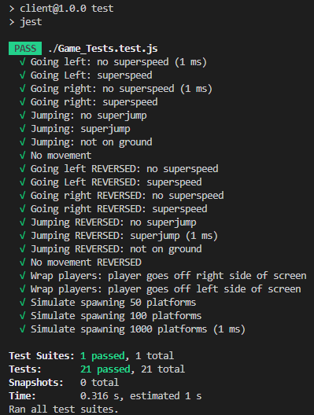
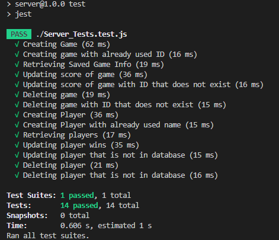

# Twoodle Jump

# Client Tests
In order to test functions within the game, the functions from level 1 were imported and modified so that values could be inserted into the function which will produce an output that would mirror the game. \
For example:
* **In-game**: Going right sets x velocity to 250
* **Test File**: Setting "right" to true in playerMoves() returns 250

Features being tested:
* Player movement w/wo superspeed
* Player movement w/wo superjump
* Reversed player movement w/wo superspeed
* Reversed player movement w/wo superjump
* Player walking off right side of screen (stage wrapping)
* Player walking off left side of screen (stage wrapping)
* Spawning platforms within the level

# Server Tests
Server tests involve all the possible calls that can be made to the database. The return status of these calls are tested to make sure API calls go through properly and return proper errors when necessary.

Features being tested:
* Creating saved game
* Creating saved game with already used ID
* Retrieving all saved games
* Updating score for game
* Updating score for game that doesn't exist
* Deleting game
* Deleting game that doesn't exist
* Creating player
* Creating player that already exists
* Retrieving all players
* Updating score for player
* Updating score for player that doesn't exist
* Deleting player
* Deleting player that doesn't exist

# How to Run Client Tests
1) cd into ``/Tests/Client/``
2) ``npm install``
3) ``npm test``

# How to Run Server Tests
Ensure that the Server is running in the background before attempting steps. To do this, cd into /Server/ and type nodemon index.js
1) cd into ``/Tests/Server/``
2) ``npm install``
3) ``npm test``